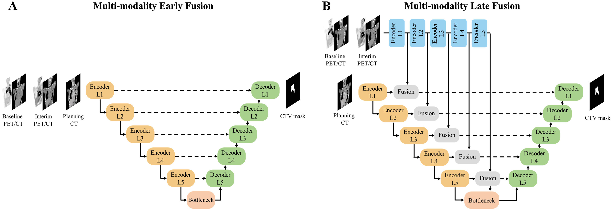
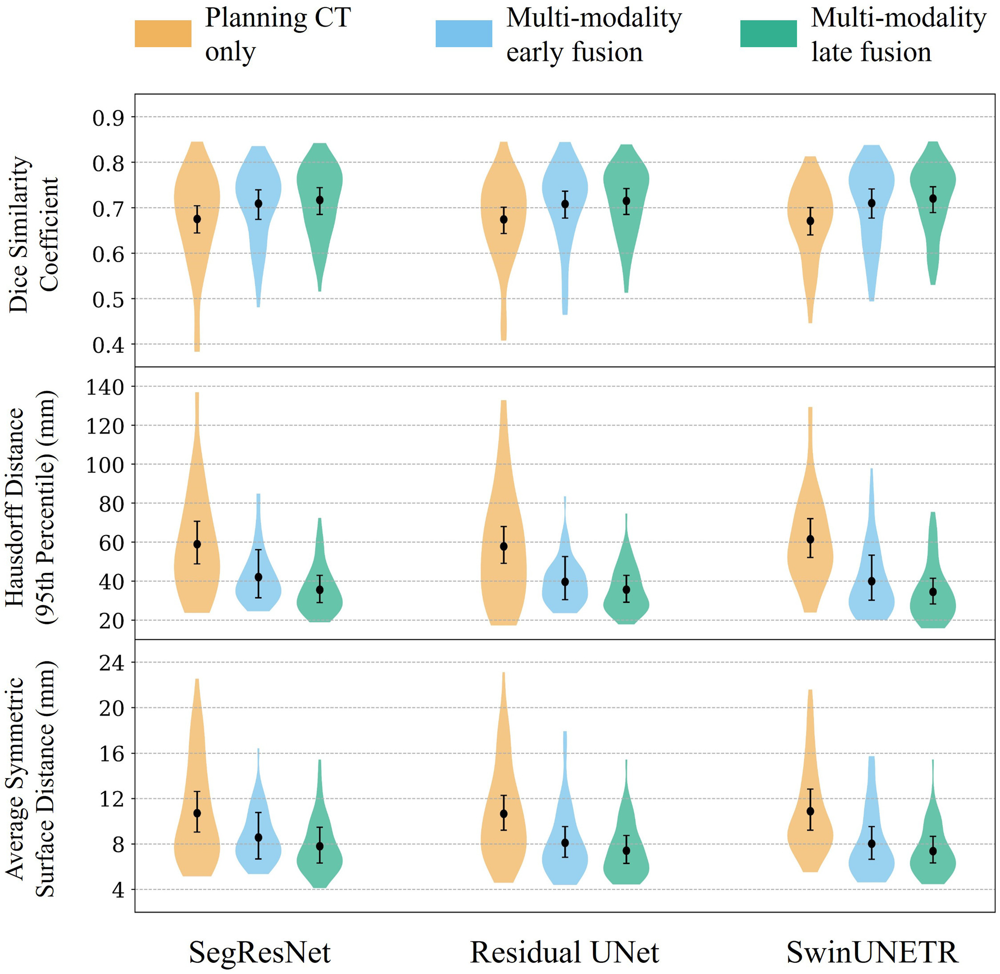
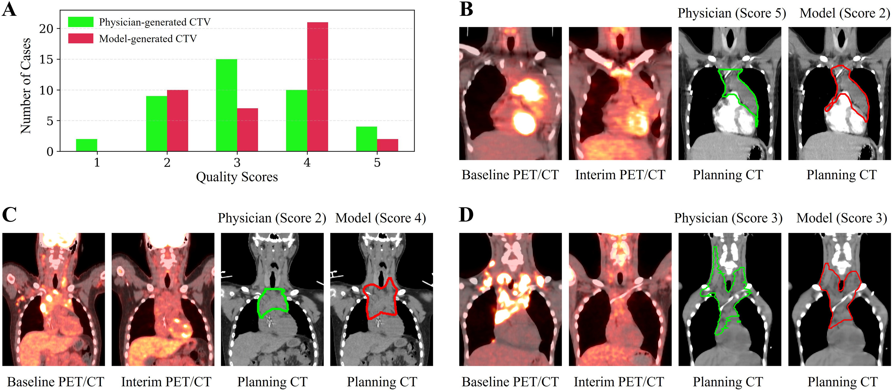
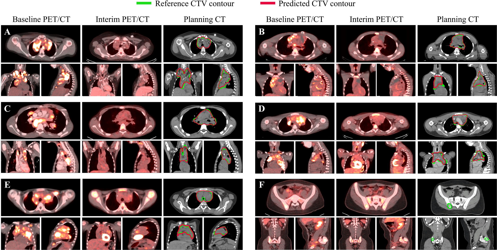

# Multi-Modality Artificial Intelligence for Involved-Site Radiation Therapy: Clinical Target Volume Delineation in High-Risk Pediatric Hodgkin Lymphoma

This repository contains the code for the paper [**Multi-Modality Artificial Intelligence for Involved-Site Radiation Therapy: Clinical Target Volume Delineation in High-Risk Pediatric Hodgkin Lymphoma**](https://www.redjournal.org/article/S0360-3016(25)06592-7/fulltext) published in ***International Journal of Radiation Oncology · Biology · Physics***.


## 📌 Overview

*Purpose*: We aim to develop automated CTV segmentation algorithms that integrated multi-modality imaging to facilitate ISRT planning.

*Methods*: This study included planning CT, baseline PET/CT (PET1), and interim PET/CT (PET2) scans from 288 pediatric patients with high-risk HL enrolled in the [**Children's Oncology Group AHOD 1331**](https://www.nejm.org/doi/full/10.1056/NEJMoa2206660) trial. Data from 58 patients across 24 institutions were held out for external testing, while the remaining 230 cases from 95 institutions were used for model development. We investigated three deep learning (DL) architectures (SegResNet, ResUNet, and SwinUNETR) and evaluated the impact of incorporating PET1 and PET2 images along with the planning CT. Performance was assessed using the Dice similarity coefficient (DSC) and 95% Hausdorff distance (HD95). Inter-observer variability (IOV) was estimated by comparing original institutional CTVs with those newly delineated by four radiation oncologists on 10 cases. The quality of CTVs generated by the top-performing model was independently assessed by radiation oncologists on 40 other cases using a 5-point Likert scale and compared against the original institutional CTVs.

*Results*: On the external cohort, a SwinUNETR model incorporating planning CT, PET1, and PET2 images achieved the highest performance, with a DSC of 0.72 and HD95 of 34.43 mm. All models incorporating PET/CT images were significantly better (P<0.01) than planning CT-only models. IOV analysis yielded a DSC of 0.70 and HD95 of 30.14 mm. In clinical evaluation, DL-generated CTVs received a mean quality score of 3.38 out of 5, comparable to original physician-delineated CTVs (3.13; P = 0.13)

*Conclusion*: The DL model was able to generate clinically useful CTVs with quality comparable to manually delineated CTVs, suggesting its potential to improve physician efficiency in ISRT planning.


## ✨ Key Points

- **First deep learning framework** developed specifically for automated involved-site radiation therapy (ISRT) CTV delineation in **pediatric Hodgkin lymphoma**

- **Longitudinal multi-modality imaging integration**, incorporating:
  - Planning CT  
  - Baseline PET/CT (PET1)  
  - Interim PET/CT (PET2)

- **Comparison of model designs**, including:
  - CNN-based vs. Transformer-based architectures  
  - Early fusion vs. late fusion strategies for multi-modality integration

- **External validation** on **58 patients from 24 institutions**

- **Inter-observer variability (IOV) benchmarking** against contours generated by board-certified radiation oncologists

- **Blinded clinical reader study** demonstrating that DL-generated CTVs achieve **contour quality comparable to physician-delineated CTVs**

---

## 🗂 Repository Structure
```bash
ISRT-CTV-AutoSeg/
├── CT_only/                # Code for CT only models (with only planning CT as input)
├── Early_fusion/           # Code for early fusion models (either baseline PET/CT+interim PET/CT+Planning CT or baseline PET/CT+Planning CT)
├── Late_fusion/            # Code for late fusion mdoels
├── folds/                  # json file for data partition
├── compute_metrics.py      # for computing segmentation metrics (DICE, HD95, ASSD)
└── README.md
```


## ⚙️ Installation
1. **Clone the Repository**
    ```bash
    git clone https://github.com/xtie97/ISRT-CTV-AutoSeg.git
    cd ISRT-CTV-AutoSeg
    ```

2. **Pull the Docker image from Docker Hub**:
    ```bash
   docker pull xtie97/monai_wb
   ```

3. **Run the Docker container**:
   ```bash
   docker run -it --rm -v $(pwd):/workspace xtie97/monai_wb
   ```

## 🧩 Preprocessing 
The baseline and interim PET/CT images were spatially aligned to planning CT images using MIM software (Cleveland, Ohio). All images were resampled to a fixed voxel size of [1.0, 1.0, 2.5] mm using bilinear interpolation. PET and CT volumes were cropped using bounding boxes derived from a SUV threshold of 0.2 on baseline PET images. PET SUVs were standardized using z-score normalization, and CT Hounsfield units were linearly scaled from [-1000, 1000] to [-1, 1].


## 🧠 Multi-Modality Architecture
**Planning CT only** vs. **Multi-modality early fusion** vs. **Multi-modality late fusion** 




## 🚀 Training and Inference
To train or evaluate the model, please go to each architecture (e.g., Late_fusion/SwinUNETR) and modify the **`configs/hyper_parameters.yaml`** file to adjust parameters (if preferred) and update the paths for your data root and data list:
```bash
cd Late_fusion/SwinUNETR
```

Starting training by runing the following command:
```bash
python run.py
```

To run inference, please change the following in the **`configs/hyper_parameters.yaml`** file:
```bash
infer: {enabled: true, ckpt_name: $@ckpt_path + '/' + 'model.pt', output_path: $@bundle_root
    + '/prediction_deform_f3', data_list_key: testing}  
```
All model weights associated with this study have been released on [**Hugging Face**](https://huggingface.co/xtie/ISRT-CTV-AutoSeg). The release includes all primary model variants as well as models developed in the ablation study, including different input configurations (planning CT with baseline PET/CT vs. planning CT with baseline and interim PET/CT) and registration strategies (rigid vs. deformable).

## 📊 Key Results
- **Model Comparison**: Quantitative results of CTV segmentation across different models.  
      
<p align="center">
  
</p>


- **Blinded Clinical Evaluation**: Among the 40 external test cases selected for clinical evaluation, the average quality score assigned to model-generated CTVs was 3.38 (95% CI, [3.08, 3.65]), comparable to the scores assigned to physician-generated CTVs (3.13, 95% CI [2.80, 3.45], P=0.13). Additionally, for model-generated contours, 10 cases (25.0%) required major revisions (score of 2), and 30 cases (75.0%) were considered clinically acceptable (scores of 3-5), with 23 cases (57.5%) requiring only minor or no modifications (scores of 4 or 5).
  - (A) Distribution of quality scores for physician-delineated (green) and model-generated clinical target volumes (CTVs) (red) on 40 external test cases, assessed using a 5-point Likert scale
  - (B–D) Example cases showing physician and model-generated CTVs along with their respective quality scores.

<p align="center">
  
</p>
 

- **Example Cases**:  Qualitative comparison between model-generated (*red*) and physician-delineated (*green*) clinical target volumes (CTVs). For patients with positive interim PET findings, cases D and E had slow-responding lesions within the mediastinum, and case F had a slow-responding lesion in the right iliac, which was not captured by the model-generated CTV.

<p align="center">
  
</p>
 

## 🎯 Future Direction
Extend the current model development and validation framework to other lymphoma subtypes and patient populations and conducting prospective studies to assess the clinical efficiency gains.

## 📚 Citation
 
```bibtex
@article{TIE2025,
title = {Multi-Modality Artificial Intelligence for Involved-Site Radiation Therapy: Clinical Target Volume Delineation in High-Risk Pediatric Hodgkin Lymphoma},
journal = {International Journal of Radiation Oncology*Biology*Physics},
year = {2025},
issn = {0360-3016},
doi = {https://doi.org/10.1016/j.ijrobp.2025.12.005},
url = {https://www.sciencedirect.com/science/article/pii/S0360301625065927},
author = {Xin Tie and Sarah A. Milgrom and Andrea C. Lo and Anne-Marie Charpentier and Michael J. LaRiviere and Danyal Maqbool and Steve Y. Cho and Kara M Kelly and David Hodgson and Sharon M. Castellino and Bradford S. Hoppe and Tyler J. Bradshaw}
